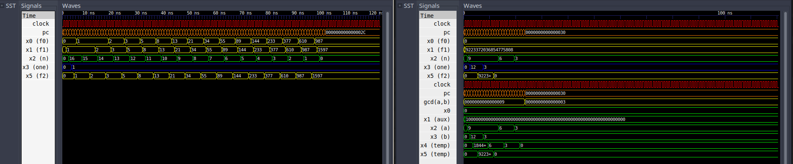

# PoliLEG 


Simplified, monocycle version of the LEGv8 processor designed
by the Department of Computer and Digital Systems Engineering
(PCS) at Escoal Politécnica da Universidade de São Paulo
(Poli-USP) and implemented in VHDL for Digital Systems II
(PCS3225) in 2021.



## Requirements
* [GHDL](https://github.com/ghdl/ghdl)
* [hdlmake](https://hdlmake.readthedocs.io/en/master/)
* [GTKWave](http://gtkwave.sourceforge.net/) (optional, used for visualising generated waveforms as shown above)

## Build
The build process once hdlmake is installed is straightforward:

1. Clone this repository
```bash
git clone https://github.com/tomaz-suller/PoliLEG.git
```

2. Enter the `simulation` directory and build with hdlmake
```bash
cd simulation
hdlmake makefile
make
```
The default options will run `fibonacci.dat` and automatically
open GTKWave to show the generated waveform using the
configuration file supplied (`fibonacci.gtkw`). This behaviour
can be altered by editing `simulation/Manifest.py` and by then
recreating the `Makefile` as described previously.

## Usage

### Running other software
PoliLEG can only execute a small subset of the ARMv8
instructions. Namely, it can only execute the following
functions, with their respective opcodes and formats for
reference. More detailed information can be found in the Green
Card of LEGv8.

Instruction | Format    | opcode        |
------------|-----------|---------------|
LDUR        | D         | 11111000010   |
STUR        | D         | 11111000000   |
CBZ         | CB        | 10110100      |
B           | B         | 000101        |
ADD         | R         | 10001011000   |
SUB         | R         | 11001011000   |
AND         | R         | 10001010000   |
ORR         | R         | 10101010000   |

Therefore, any software must be specifically designed to only
use these instructions. As this processor was developed for
educational purposes, the supplied software (`fibonacci.dat`)
and (`gcd.dat`) were handwritten in LEGv8 Assembly and then
manually converted to machine code.

### Copying standalone components
Any component is avaliable for use in other projects
**if and only if** these projects comply with this software's
LICENSE. Most importantly, it is work noting that your work
**must disclose its full source** if it uses any part
whatsoever of this software.

It is also worth noting this repository is **NOT** meant to
provide ready-made implementations for the course's projects.
Therefore, this software
**cannot be submitted as proof of your own work, and any known attempts to do so will be reported immediately without exception**.

## Repository Structure
Directories were set up according to hdlmake's example setup.
* `github`: media content used in the README;
* `modules`: hardware descriptions of components used to build
    the processor, including a dummy toplevel implementation
    for testing purposes;
* `simulation`: files related to simulation with GHDL (
    hdlmake's `Manifest.py` and GTKWave configuration files);
* `software`: content of both the instruction memory
    (`rom.dat`) and the data memory (`ram.dat`). A GCD
    calculator using Euclides' Algorithm (`gcd`) and a Fibonacci
    sequence generator (`fibonacci`) are supplied;
* `testbenches`: testbenches for hardware descriptions following
    the structure of `modules`. Note that all components have
    testbenches with assertions except for `polilegcs`,
    `datapath` and `toplevel`.

## References
D. Patterson and J. Hennessy.
*Computer Organization and Design ARM Edition: The Hardware Software Interface.*
The Morgan Kaufmann Series in Computer Architecture
and Design. Elsevier Science, 2016.
